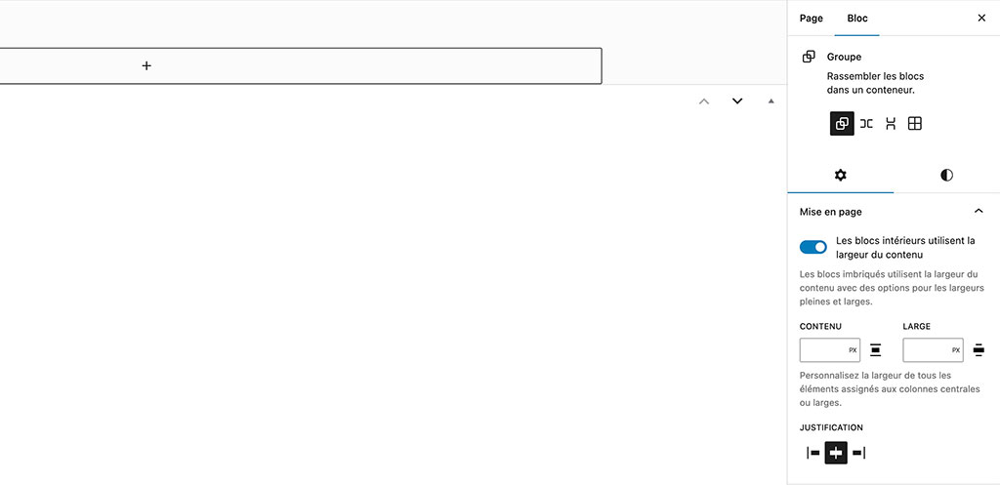
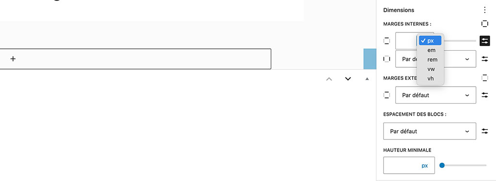
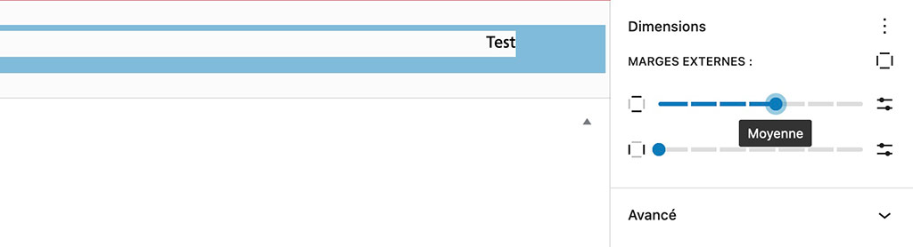
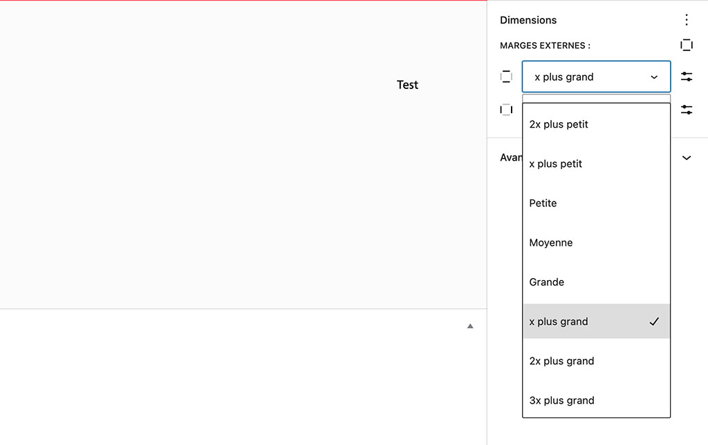
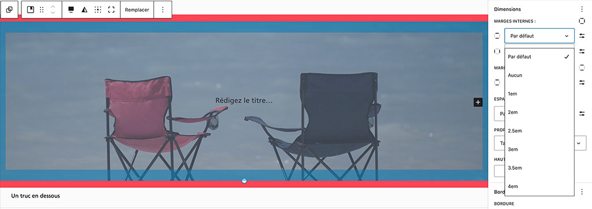
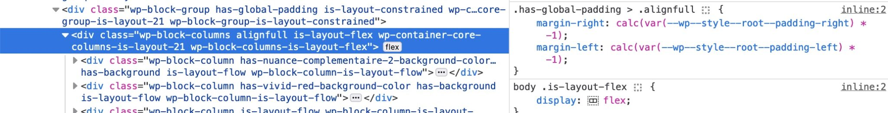
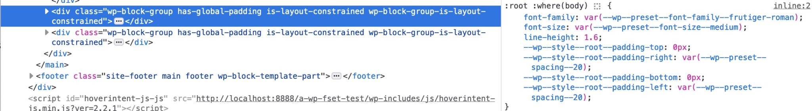
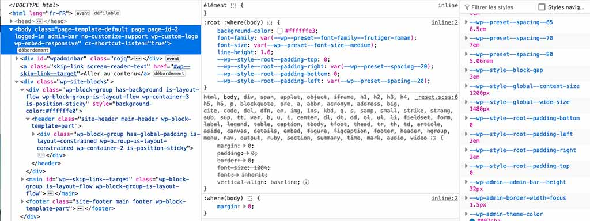
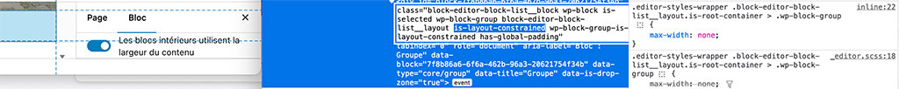
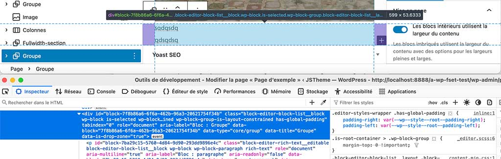

# Documentation sur la gestion des dimensions des blocs dans WordPress

Lors de la création d'un site WordPress avec un thème FSE (Full Site Editing), l'une des premières étapes cruciales est de définir les dimensions des blocs, notamment les blocs de contenu et les blocs élargis. Ces paramètres sont souvent utilisés pour contrôler l'apparence de ces éléments, en particulier leur largeur dans la page.

## Configuration des dimensions dans `theme.json`

Les dimensions des blocs sont configurées dans le fichier `theme.json` au sein de la section `settings` : `{ "layout" }`. Cette configuration détermine la largeur maximale du contenu et des blocs élargis (wide). Ces paramètres s'appliquent globalement à tous les blocs conteneurs de la page.

### Exemple de configuration dans `theme.json` :

```json
{
    "settings": {
        "layout": {
            "contentSize": "1280px",
            "wideSize": "1440px"
        }
    }
}
```

contentSize : Définit la largeur maximale pour les blocs de contenu classiques. Dans cet exemple, elle est fixée à 1280px.
wideSize : Définit la largeur maximale pour les blocs élargis (wide). Dans cet exemple, elle est fixée à 1440px.

## Application des dimensions aux blocs

Ces dimensions s'appliqueront automatiquement à l'ensemble des blocs conteneurs de la page. Les blocs en mode pleine largeur ou élargie ne pourront pas avoir une taille différente de celle définie par ces paramètres dans theme.json.

### Règles CSS générées

La configuration des dimensions dans le fichier theme.json ne génère pas de règle CSS width dans la feuille de style de WordPress. Cependant, elle attribue une largeur maximale aux blocs du conteneur principal. Voici un exemple de ce que cela pourrait produire dans le CSS de votre thème

```css
.wp-container-my-block-id > * {
    max-width: 1280px;
    margin-left: auto !important;
    margin-right: auto !important;
}

.wp-container-my-block-id > .alignwide {
    max-width: 1440px;
}

.wp-container-my-block-id > .alignfull {
    max-width: none;
}
```



`.wp-container-my-block-id > * :` Cette règle applique une largeur maximale de 1280px pour tous les éléments dans le conteneur, avec une mise en page centrée grâce à margin-left et margin-right définis sur auto.
`.wp-container-my-block-id > .alignwide :` Cette règle applique une largeur maximale de 1440px pour les blocs alignés en mode large (wide).
`.wp-container-my-block-id > .alignfull :` Les blocs en mode pleine largeur (full width) n'ont pas de restriction de largeur maximale, donc la règle max-width: none est utilisée pour les étirer sur toute la largeur disponible.

### Contrôle des dimensions pour les blocs imbriqués (InnerBlocks)

Certains blocs imbriqués, comme les blocs de boucle de requête, les groupes, les contenus de publication, les bannières, les blocs de texte et média, ou encore les colonnes, utilisent ces valeurs de contentSize et wideSize définies dans theme.json. Cependant, ces blocs peuvent également être ajustés via deux champs individuels dans l'éditeur Gutenberg :

`content : ` Permet d'ajuster la largeur du bloc de type contenu.
`wide : ` Permet d'ajuster la largeur du bloc en mode large (wide).
Ces contrôles permettent de personnaliser les dimensions des blocs imbriqués tout en respectant les valeurs définies globalement dans le fichier theme.json.

## Choix des unités de réglages pour les marges et espaces

En fonction des conventions requises pour la livraison de votre thème FSE, vous pourrez proposer aux utilisateurs, tout ou partie des unités valides pour les spécifications CSS pour la définition des espacements sur le site.

Ces unités sont définies à l’aide de la propriété « units » de la même sous-section du fichier theme.json :

```json
{
    "settings" : {
        "spacing" : {
            "units" : [ "px", "rem", "em", "vw", "wh" ]
        }
    }
}
```

L’interface Gutenberg proposera alors une liste déroulante incluant l’ensemble des unités mises à disposition dans le fichier de configuration du thème.



## Gestion des marges internes et externes sur un thème Full Site Editing de WordPress

Les marges externes et internes (margin et padding) sont désactivées par défaut pour les thèmes FSE (basés sur les blocs) de WordPress. Nous aurons donc besoin d’activer leur fonctionnalité dans la section « settings » du fichier `theme.json` pour nous en servir sur le thème, et proposer à l’utilisateur WordPress des contrôles de blocs en relation.

```json
{
    "settings": {
        "useRootPaddingAwareAlignments": true,
        "spacing": {
            "margin": true,
            "padding": true
        }
    }
}
```

On notera néanmoins que l’activation de la propriété appearanceTools dans la même section permettra de ne pas avoir 
à activer cette prise en charge des marges.

```json 
{
    "settings": {
        "appearanceTools": true
    }
}
```

Cette même section « settings » va aussi nous permettre d’activer la gestion des marges pour des groupes spécifiques au sein de la sous-section blocks. Cette possibilité sera notamment intéressante sur un site WordPress n’étant pas destiné à être stylisé plus avant par l’utilisateur final :

```json
{
    "settings": {
        "blocks": {
            "core/site-title": {
                "spacing": {
                    "padding": false,
                    "margin": false
                }
            }
        }
    }
}
```

## Définition des marges de la racine du document

Pour rappel, la balise <body> est la racine de la partie visible du document présenté à l’internaute.

Après avoir activé la gestion des marges sur notre thèmes FSE, la section « styles » du fichier theme.json du thème WordPress permettra non seulement de faire un reset des marges externes de <body>, mais également de définir les paddings (les marges internes ou « rembourrages ») permettant notamment de s’exonérer de la définition d’une largeur en pourcentage (%) pour les blocs conteneurs :

```json 
{
    "styles" : {
        "spacing" : {
            "padding" : {
                "top" : 0,
                "bottom" : 0,
                "left" : "1.5rem",
                "right" : "1.5rem"
            },
            "margin" : {
                "top" : 0,
                "bottom" : 0,
                "left" : 0,
                "right" : 0
            }
        }
    }
}
```

`N.B.`  Nous avons défini une propriété « useRootPaddingAwareAlignments » permettant de générer sur notre feuille de styles des variables de padding au sein du sélecteur body, et d’attribuer aux premiers éléments enfants du conteneur <main> une classe « .has-global-padding » permettant de les styliser avec ces 4 propriétés :

```css
body {

    --wp--style--root--padding-top: 0px;

    --wp--style--root--padding-right: 1.5rem;

    --wp--style--root--padding-bottom: 0px;

    --wp--style--root--padding-left: 1.5rem;
}

.has-global-padding {
    padding-right: var(--wp--style--root--padding-right);
    padding-left: var(--wp--style--root--padding-left);
}
```

`N.B.` Les configurations de margin et de padding de la section « style » : « spacing » sont retranscrites pour le sélecteur body{}.


Mais si ce comportement est utile pour une mise en page emboîtée (ou « contenue ») elle se prête néanmoins peu aux templates basés sur des sections horizontales pleine largeur. On pourra alors privilégier l’utilisation d’un bloc InnerBlock de type « groupe » pour créer les sections parentes de notre choix, et y intégrer des sous-bloc, groupes, colonnes, etc., auxquels nous attribuerons des réglages de taille, marges et autres dimensionnements. Regardons cela tout de suite…

## Définition des marges par défaut pour les blocs

De façon assez intuitive, nous pouvons reproduire la structure JSON de premier niveau, en ciblant cette fois-ci la sous-section « styles » : { « blocks » : ( « mon/block » : { « spacing » } } } pour définir des réglages spécifiques à ces blocs Gutenberg :

```json 
"styles" : {
     "blocks" : {
        "core/cover" : {
            "spacing" : {
                "padding" : {
                    "top" : "2em",
                    "bottom" : "2em"
                }
            }
        }
    }
}
```

## Définition native des marges pour les thèmes de blocs FSE de WordPress

l existe par défaut, 8 valeurs permettant à l’utilisateur WordPress de définir les marges utilisées sur son site internet (la 1re valeur correspondant à zéro : 0).

Par défaut toujours, chacune des valeurs natives d’espacement :

Multiplie la précédente par 1.5 ;
    Génère une variable CSS de type « –wp–preset–spacing-X » où X est respectivement égale à 20, 30, 40, 50, 60, 70 et 80 ;
    Est numéroté sur une échelle de 1 à 7 (le zéro supprimant toute marge du bloc).
    Est libellée de façon suivante :
    Aucun
    2x plus petit
    X (1x) plus petit
    Petite
    Moyen
    Grande
    x plus grande
    2x plus grande
Par défaut enfin, les valeurs de ces propriétés valent respectivement :

    0.44rem ;
    0.67rem ;
    1rem ;
    1.5rem ;
    2 .25rem ;
    3.38rem ;
    5.06rem.



## Personnalisation des marges proposées à l’utilisateur d’un thème de bloc WordPress

La configuration des marges passe encore une fois par les deux sections « settings » et « styles » du fichier theme.json :

La section « settings » : { « spacing » } correspond à un objet json possédant 7 propriétés :

- Les propriétés booléennes « margin » et « pading » permettent d’activer ou de désactiver le système sur les blocs ;
- La propriété « blockGap » sert à définir l’espacement entre les blocs et les colonnes à l’échelle du site ;
- La propriété booléenne « customSpacingSize » autorise la personnalisation des marges au niveau utilisateur ;
- L’objet « spacingScale » contient un ensemble de propriétés définissant l’échelle des marges, telles que l’opérateur de calcul, le facteur d’opération, le nombre d’étapes et la valeur de l’étape médiane et l’unité de configuration ;
- « Le tableau « spacingSizes » contient une collection (un tableau) d’objets décrivant des d’espacements personnalisés qui seront proposés à l’utilisateur ;
- Le tableau « units » permet enfin de proposer à l’utilisateur un set d’unités de réglage des marges.

### Incrémentation personnalisée des marges de blocs

L’incrémentation de l’échelle de marges proposée nativement par WordPress définit donc 7 valeurs, en commençant à 0.44rem, puis en multipliant chacune par 1,5 pour calculer la suivante.

Cet algorithme dispose logiquement d’une interface permettant de définir l’opérateur, la valeur d’incrémentation, le nombre de pas (les étapes), la valeur médiane de l’échelle et l’unité de valeur.

C’est cette interface que nous utiliserons au sein de l’objet « spacingScale » de la sous-section « settings » : { « spacing » } du fichier theme.json. L’interface de l’éditeur du thème Full site Editing de WordPress, mettra alors à jour les valeurs disponibles pour l’utilisateur :

```json 
"settings" : {
     "spacing" : {
         "spacingScale" : {
            "operator" : "+",
            "increment" : .5,
            "steps" : 9,
            "mediumSteps" : 2.5,
            "unit" : "rem"
        }
    }
}
```



`N.B.` une définition d’un nombre d’étapes, supérieur au nombre proposé par défaut par WordPress, génère un contrôle basé sur une liste déroulante et adapte les libellés au standard WordPress (« 2x plus grand », « 3x plus grand », etc.

### Tableau des marges personnalisées : « spacingSizes »

Les libellés par défaut des étapes d’échelle de marges n’étant pas très intuitifs, Il pourra être intéressant de recréer ladite échelle en intégralité afin d’offrir à l’utilisateur final une vision plus parlante des réglages effectués :

```json
"spacingSizes" : [
    {
        "name" : "1em",
        "size" : "1em",
        "slug" : "10"
    },
    {
        "name" : "2em",
        "size" : "2em",
        "slug" : "20"
    },
    {
        "name" : "3em",
        "size" : "3em",
        "slug" : "30"
    },
    {
        "name" : "4em",
        "size" : "4em",
        "slug" : "40"
    },
    {
        "name" : "5em",
        "size" : "5em",
        "slug" : "50"
    },
    {
        "name" : "6em",
        "size" : "6em",
        "slug" : "60"
    },
    {
        "name" : "7em",
        "size" : "7em",
        "slug" : "70"
    }
  ]
```



Chaque objet de ce tableau correspond à une marge personnalisée et présente ainsi 3 propriétés :

```json
{
       "name" : "nom de la taille",
       "size" : ".25rem",
       "slug" : "nom-de-la-taille"
}
```

### Styles de marge au niveau global et génération des variables CSS

La section « styles » du fichier WordPress theme.json permet de définir les styles du site sur plusieurs niveaux.

Les propriétés implémentées à la racine de cet objet définissent les réglages au niveau global du site, et permettent notamment de générer des variables CSS utilisées pour assigner ces marges au sélecteur <body> du document.

Ces variables serviront entre autres :

1 : À styliser appliquer des marges internes (padding) sur les blocs marqués de la classe « .has-global-padding » ), à l’aide de ces mêmes variables, afin de créer un rembourrage sur blocs pleine-largeur 



2 : À appliquer les padding verticaux sur le conteneur de blocs 



```json
"styles" : {
      "spacing" : {
            "padding" : {
                  "top" : "0px",
                  "bottom" : "0px",
                  "left" : "1em",
                  "right" : "1em"
            }
      }
}
```

```css
:root :where(body) {
       --wp--style--root--padding-top: 0px;
       --wp--style--root--padding-right: var(--wp--preset--spacing--20);
       --wp--style--root--padding-bottom: 0px;
       --wp--style--root--padding-left: var(--wp--preset--spacing--20);
}
/* body > div.wp-site-blocks /*balise englobante des blocs */
.wp-site-blocks {

      padding-top: var(--wp--style--root--padding-top);
      padding-bottom: var(--wp--style--root--padding-bottom);
}
.has-global-padding {
      padding-right: var(--wp--style--root--padding-right);
      padding-left: var(--wp--style--root--padding-left);
}
```

`N.B.` Les blocs plein largeur dotés de la classe CSS « .has-global-padding » se verront attribuer des marges externes (gauche et droite) vallant -1 X les valeurs de padding précédemment définies :


`N.B.` On remarque aussi qu’afin de conserver une homogénéité des rythmes à l’échelle du site, nous pouvons tout à fait appeler les valeurs de l’échelle de marges précédemment définies

```json 
"left" : "var(--wp--preset--spacing--20)"
```

La configuration des « margin » de la section « styles » permet quant à elle d’appliquer des marges externes directement sur le sélecteur <body>. On s’en servira typiquement pour établir un reset des marge sur cet élément HTML  :

```json 
"margin" : {
      "top" : "0",
      "bottom" : "0",
      "left" : "var(--wp--preset--spacing--20)",
       "right" : "var(--wp--preset--spacing--20)"
}
```



### blockGap, lineHeight et espacement des titres : le rythme de la mise en page

Le rythme d’une mise en page correspond aux espacements horizontaux et verticaux des blocs affichés. Deux propriétés CSS peuvent aider à définir un rythme vertical homogène à l’échelle du site : « blockGap » et « lineHeight » .

#### blockGap
Techniquement, WordPress applique la valeur définie par la propriété « blockGap » à l’espacement entre les colonnes, ainsi que pour la marge supérieure des blocs de groupe, de colonnes, et autres blocs de mise en page de flux « flow ».

Mais si la définition de marges globales peut fournir un procédé simple d’homogénéisation de la mise en page, le problème posé par un tel procédé est une application systématique de ces marges verticales aux blocs de paragraphes, de citations, exergue, etc.

```json
{
    "styles" : {
        "spacing" : {
            "blockGap" : "3em"
        },
        "blocks" : {
            "core/group" : {
                "spacing" : {
                    "blockGap" : "2em"
                }
            }
        }
    }
}
```

#### lineHeight
À l’instar de la définition du « blockGap », la hauteur de ligne et la taille de police du document se définissent aussi directement dans la section « styles » : ( « typography » } du fichier theme.json  :

```json 
"styles": {
    "typography" : {
        "fontSize" : "1.6rem",
        "lineHeight" : 1.5
    }
}
```

### Solution de redéfinition des marges de blocs de groupes et de titres
La solution native de définition du rythme de mise en page étant un peu radicale, une surcharge CSS des blocs enfants de 1er niveau et des blocs imbriqués s’avère une technique complémentaire relativement simple à mettre en œuvre, directement via une feuille de style externe ou via un préprocesseur SCSS.

#### Rythme des blocs de groupe
Je vous propose donc ici, au sein de votre feuille de style principale, une solution de remise à zéro des marges de blocs de groupe (correspondant aux sections verticales des pages WordPress), ainsi qu’une redéfinition des marges supérieures de leurs blocs imbriqués :

```css
/* Reset des marges de groupe de 1er niveau */
:where(body .is-layout-flow) > * {

    margin-block-start: 0;
}
/* Surcharge des marges supérieures des blocs imbriqués */
:where(body .is-layout-constrained) > * {

    margin-block-start: var( --wp--preset--spacing--10 );
}
```

De cette façon, dans votre fichier theme.json, vous pourrez définir une taille de gouttière correspondant à une marge préalablement prédéfinie, sans impacter les blocs de contenu de vos pages WordPress :

```json
"styles": {
    "colors":{},
    "spacing":{
        "blockGap": "var(--wp--preset--spacing--30)"
    }
}
```

`N.B.`

1 : Pour rappel, la class « .is-layout-constrained » est attribuée aux blocs pour lesquels l’option « Inner blocks use content width » (les blocs intérieurs utilisent la largeur du contenu) est activée, et donc limités aux dimensions du contenu prédéfinies par défaut ou dans le fichier theme.json. Ces blocs bénéficieront aussi de la classe « .has-global-padding » garantissant l’intégration de marges internes de « rembourrage ».





2 : La class « .is-layout-flow » est quant à elle appliquée aux blocs dont les blocs enfants ne bénéficient pas de la largeur du contenu.

#### Espacement contextuel des titres

Dans ce contexte, et afin de cibler les éléments HTML sur le front office comme sur l’éditeur Wordpress, nous pouvons utiliser conjointement les enfants des classes « .is-layout-flow » et « .is-layout-constrained », pour définir des marges homogènes pour l’ensemble des titres du document, qu’ils soient inclus dans un groupe ou à la racine de l’arborescence :

```css
.is-layout-flow * + :is(h1,h2,h3,h4,h5,h6),

.wp-block-group :is(h1,h2,h3,h4,h5,h6),

.editor-styles-wrapper .wp-block-heading {
    margin-block-end: var( --wp--preset--spacing--10 );
}
```